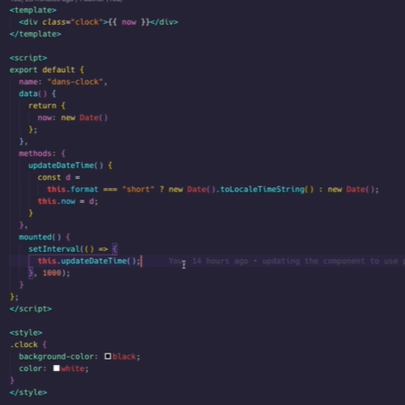

# My VUE

## My VUE skills

- Vue CLI
- Vue Router
- State Management with Vuex
- Vue Components
- Single File Components
- Directives
- Vue Instance
- Vue Lifecycle Hooks
- Vue Composition API
- Vue Options API
- Vue Templates
- Props and Events
- Slots
- Vue Transitions and Animations
- Vue Directives
- Vue Mixins
- Vue Custom Directives
- Vue Filters
- Vue DevTools
- Vue SSR
- Nuxt.js
- Vue Testing with Jest and Vue Test Utils
- Vue with TypeScript
- Axios for Vue
- Vue Plugins
- Vue3 Composition API
- Vue3 Teleport
- Vue3 Suspense

<!--
Simple component

-->

## My VUE Projects

### Project 1

<!-- RBC -->

Developed and deployed scalable RESTful APIs for a web application on Azure

- Designed and implemented REST APIs using Java, Spring Boot, and Hibernate, interacting with Azure SQL for persistent data storage.
- Created a responsive and dynamic front-end using Vue.js, integrating seamlessly with back-end services.
- Optimized API performance by integrating Redis for caching and sidecar patterns for efficient service communication.
- Automated deployment on Azure using Kyvos Kubernetes and Jenkins CI/CD pipelines.
- Onboarded APIs to the Apigee API Gateway for centralized management and enhanced security.
- Enhanced observability by configuring logs and metrics monitoring through Splunk and Dynatrace.
